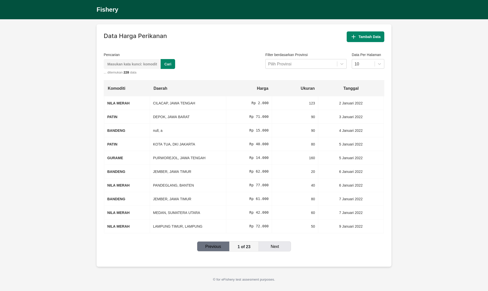
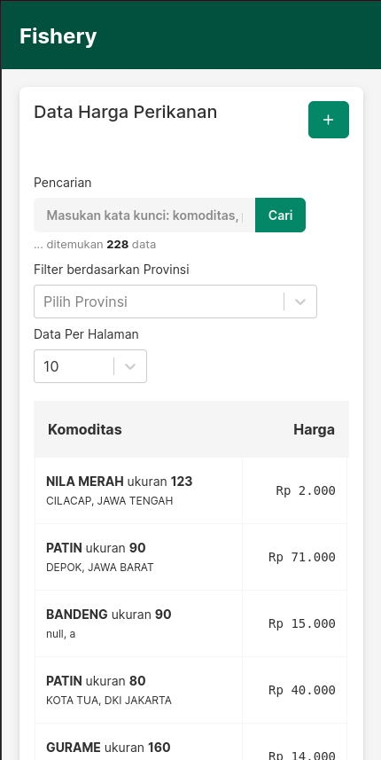
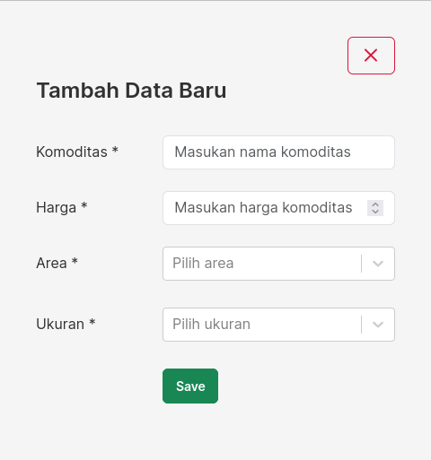

# Context

There is data from the sheet [https://stein.efishery.com/v1/storages/5e1edf521073e315924ceab4/list](https://stein.efishery.com/v1/storages/5e1edf521073e315924ceab4/list). We need to serve this data, which is about fishery prices in various areas. It includes commodities (fish names), cities, provinces, prices, sizes, and data creation dates.

# Goals

We need basic features:

1. View and search for the desired data list.
2. Sort and filter data based on the desired column.
3. Add data to the price "list."

The desired goals are:

1. A pleasant experience for searching and viewing data.
2. An enjoyable experience for adding data.
3. A display that can be comfortably enjoyed on both desktop and mobile.

# Problems

The problem arises from the API, which has limited pagination capabilities. It only offers a 'limit' to set items per page and 'offset' for paging, as mentioned in the documentation [https://docs.steinhq.com/read-data](https://docs.steinhq.com/read-data). It lacks common pagination features like search, sorting, or filtering in the parameters, so I choose not to use 'limit' and 'offset' due to that limitation.

Considering this problem and our goals of having search, sort, and filter functionality, I fetch all data without 'limit' and 'offset', although it may lead to slower loading on the client side.

# Solution

## Speed Problem

My plan is to use a web worker to cache data with a stale-while-revalidate strategy. However, the API doesn't provide a header to inform the 'max-age' of the data, so we need to handle caching manually on the client side. For now, I fetch data from the server on every visit or page reload.

## Mobile View and Desktop View

I propose an adaptive design approach rather than a responsive one because serving data on mobile and desktop requires different layouts. In adaptive design, the UI adapts based on the screen width.

1. **Desktop View**
   For the desktop view, I suggest a common solution: displaying a list of data using a table with pagination.
   
   

2. **Mobile View**
   For the mobile view, I recommend combining some data and displaying only two columns: 'Komoditas' and 'Price'. In the 'Komoditas' column, I combine data from 'size', 'province', and 'city' to achieve a compact yet readable view from my perspective.
   
   

## Functionality

- **Search**: The search input searches for data based on commodity (fish name), province, and city. It also provides information about the number of matching data.
- **Filter by Province**: Users can filter data based on the selected province, and they can choose multiple provinces.
- **Per Page**: Basic pagination functionality, allowing users to display 10, 25, 50, or 100 items per page.
- **Bottom Navigation**: Navigation options using Next and Previous.
- **Client-Side Navigation**: All navigation is performed on the client side, with no API calls when searching, sorting, filtering, or moving to other pages.

## Input New Data

I suggest a straightforward approach: when the user clicks the button, a modal with a form appears. Users can fill in fish name, price, area (province and city), and size, and then save the new data. The area options are fetched from [https://stein.efishery.com/v1/storages/5e1edf521073e315924ceab4/option_area](https://stein.efishery.com/v1/storages/5e1edf521073e315924ceab4/option_area), and the size options come from [https://stein.efishery.com/v1/storages/5e1edf521073e315924ceab4/option_size](https://stein.efishery.com/v1/storages/5e1edf521073e315924ceab4/option_size).

.
